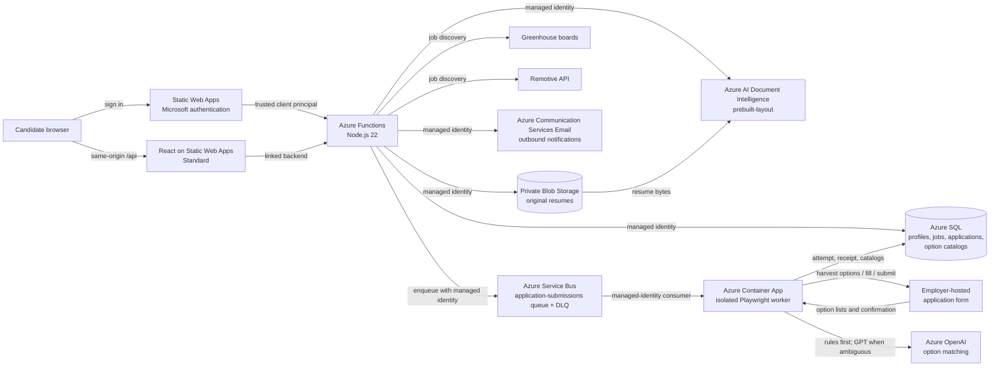
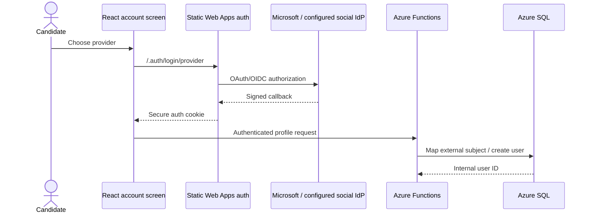
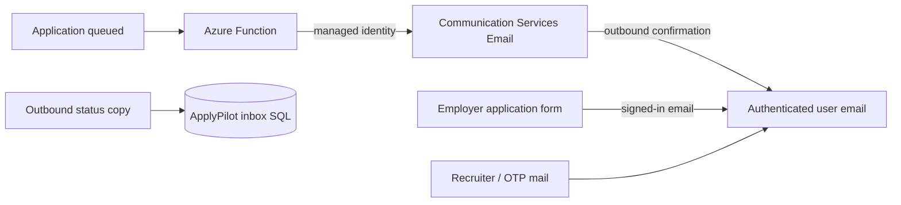
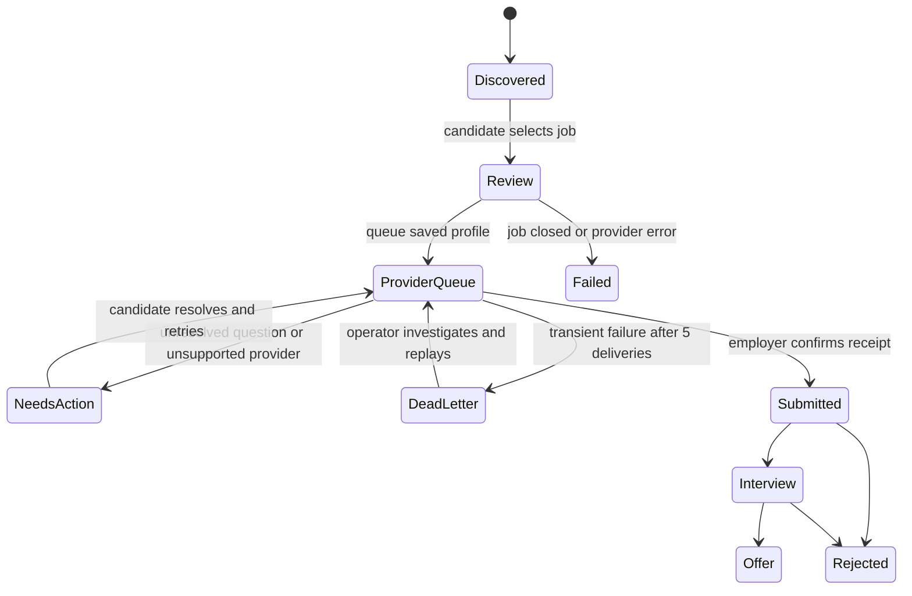
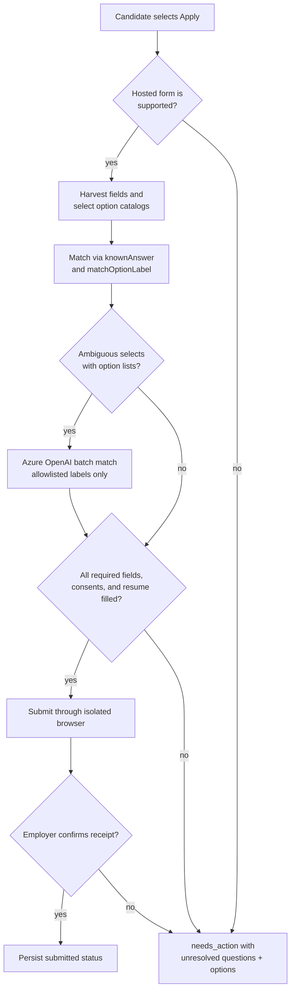
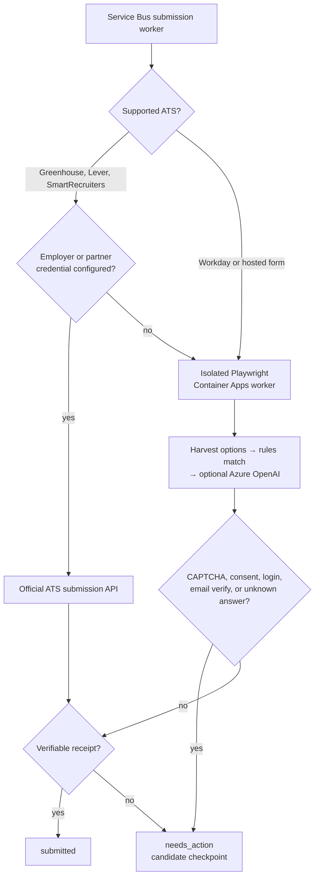
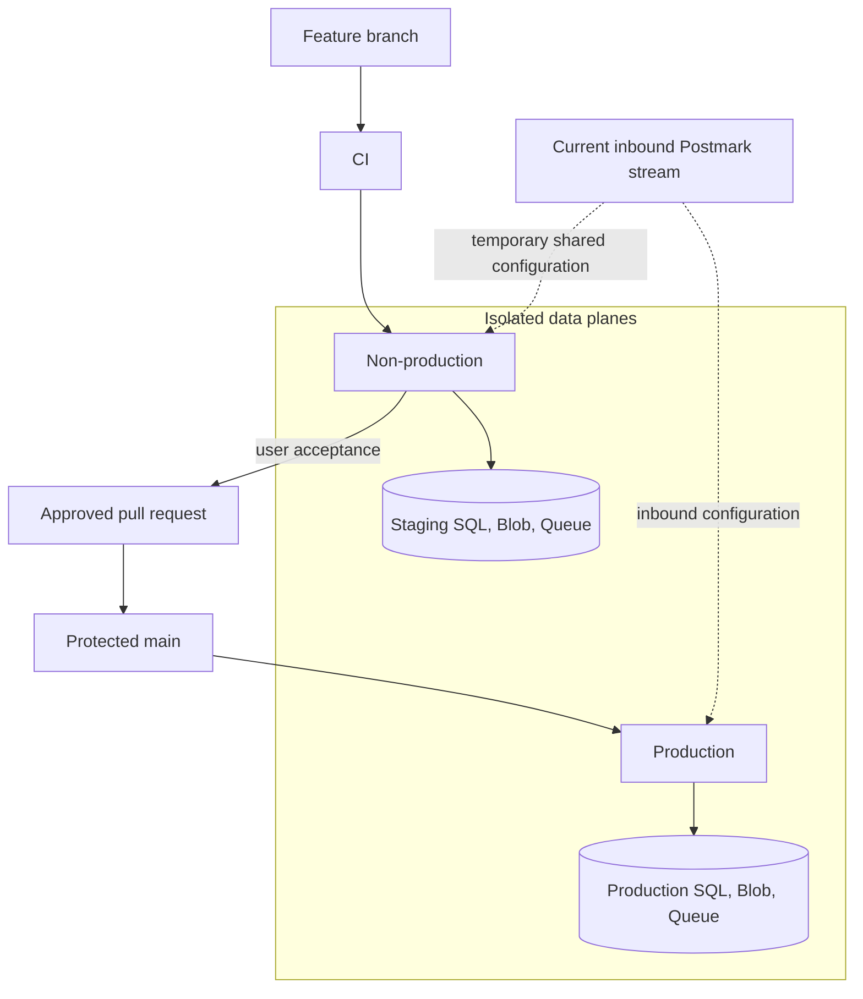

# ApplyPilot architecture

## System context

ApplyPilot is a review-first job application assistant. It discovers current jobs and prepares reusable candidate data, while the candidate reviews employer-specific questions and performs the final submission on the employer's site.

## End-to-end flows

### Authentication and user boundary

1. Static Web Apps authenticates the candidate with Microsoft Entra ID.
2. The linked backend receives the platform-generated `x-ms-client-principal` header.
3. Functions reject personal API calls without that trusted principal.
4. The external subject is mapped to an internal SQL user ID. Every profile, document, and application query is scoped to that ID.

Microsoft, Google, and GitHub are registered in `staticwebapp.config.json` and enabled in the UI when listed in `AUTH_PROVIDERS` (for example `aad,google,github`). Facebook requires a separate developer registration and remains disabled until those credentials and callbacks are configured; the app never simulates a successful provider.

### Email notification and inbound mailbox

Employer forms always receive the authenticated user's email. Azure Communication Services remains the outbound notification service; status emails are also mirrored into `dbo.InboundMessages`. Postmark inbound aliases are not used on applications.

### Resume ingestion and profile enrichment

1. The signed-in browser sends a PDF or DOCX of at most 4 MB to `POST /api/resume` (the F0 analysis limit).
2. The Function validates MIME type and size and stores the original in the private `resumes` container under a hashed user prefix and random filename.
3. The Function uses its managed identity to call the GA `prebuilt-layout` Document Intelligence model.
4. Deterministic parsing derives candidate name, email, phone, LinkedIn, portfolio, and recognized technical skills from returned text.
5. Extraction output and status are recorded only as document metadata. Uploading a résumé never modifies candidate profile fields or queued application answers.
6. The résumé library lists every retained version. Authenticated users can preview PDFs through React PDF, download DOCX files, and remove documents they own.

If analysis fails, the upload remains available and is recorded with `failed` extraction status. A temporary analysis failure therefore does not lose the candidate's file.

### Job discovery and application lifecycle

1. Azure Functions retrieves current jobs from configured Greenhouse boards and Remotive, normalizes them, and synchronizes searchable metadata to SQL.
2. The browser queries `/api/jobs`, filters results, and displays source provenance and direct employer URLs.
3. **Simple Apply** creates a SQL `review` record containing the job and saved profile answers without navigating away from ApplyPilot.
4. `POST /api/applications/{id}/submit` verifies ownership, changes the record to `queued`, and sends an idempotent message to Azure Service Bus.
5. The isolated Playwright container loads the authoritative application, profile, and primary résumé using managed identities.
6. On supported hosted forms, the worker harvests native and react-select option lists, matches them to the profile with deterministic rules first, and calls Azure OpenAI only for remaining ambiguous selects (answers must appear in the harvested allowlist). Shared catalogs such as school lists persist in SQL for reuse.
7. Missing required questions, CAPTCHA, login, consent, email verification, or an unrecognized employer step moves the application to `needs_action` with structured questions (including harvested `options` when available); it is never represented as submitted.
8. Transient provider errors are retried by Service Bus up to five deliveries, then retained in the dead-letter queue for investigation.
9. Only a non-empty employer receipt advances the record to `submitted`; every attempt and receipt is audited in SQL.
10. Only an explicit profile save refreshes blank answers on review applications; résumé uploads remain isolated from profile and application data.

### Browser submission and candidate checkpoint

The public Greenhouse feed exposes application questions, but its write API requires a private key issued by each hiring company. ApplyPilot therefore uses the employer-hosted application form through its first-party Playwright worker when no authorized write API exists. Option matching is rules-first; Azure OpenAI is used only when a harvested select list remains ambiguous, and model output is rejected unless it is an exact option string from that field. The worker pauses for missing required questions, consent, CAPTCHA, login, email verification, and unrecognized steps. A confirmation page is required before the application is marked submitted.

The worker is not a generic browser-automation proxy. It accepts only application IDs from the private Service Bus queue, retrieves server-owned URLs and user-scoped records from SQL, and runs at one application per replica. CAPTCHA bypass, account recovery, and invented answers are prohibited. When `AZURE_OPENAI_ENDPOINT` is unset, GPT matching is skipped and heuristic matching alone continues.

### Provider API and browser-automation routing

Greenhouse Job Board, Lever Postings, and SmartRecruiters Application APIs can submit applications, but their write endpoints require a key or OAuth scope issued to the hiring company or an approved integration partner. They are not universal applicant credentials. Workday does not publish an equivalent general-purpose candidate submission API. ApplyPilot therefore prefers official APIs when an authorized employer credential exists and otherwise routes supported hosted forms to an isolated Playwright worker. Browser automation must stop before CAPTCHA circumvention, new consent, account recovery, or unanswered screening questions and resume only after candidate action.

## Azure resources and security

| Component | Purpose | Security boundary |
| --- | --- | --- |
| Static Web Apps Standard | React hosting, Microsoft authentication, linked `/api` proxy | Personal API routes require the `authenticated` role |
| Azure Functions Consumption | API and orchestration | Stable user-assigned runtime identity plus system identity for private package loading; direct linked backend protected |
| Azure SQL Basic | Users, profiles, jobs, applications, document metadata, shared employer option catalogs | Entra app access; personal queries include the internal user ID |
| Storage account | Function runtime and original resumes | Public blob access disabled; private container; managed-identity RBAC |
| Document Intelligence F0/S0 | Resume OCR and layout extraction | Local keys disabled; managed-identity RBAC |
| Azure OpenAI | Batch match of ambiguous select options to profile answers | Local keys disabled; Cognitive Services OpenAI User on worker (and backend) managed identity; optional when endpoint unset |
| Communication Services Email | Outbound application queue notifications | Azure-managed domain; managed-identity sender role; no inbound mailbox |
| Azure Service Bus Basic | Durable application submission queue and dead-letter retention | Local/SAS auth disabled; Function sends and browser worker receives with managed identities |
| Azure Container Apps | Playwright browser worker | Isolated Chromium container; managed identity for queue, SQL, Blob, ACR, and OpenAI |
| Application Insights | Runtime diagnostics | 30-day retention configured by Bicep |
| Key Vault | Future application secrets | Function identity access; no resume or profile payloads stored here |

Traffic uses HTTPS/TLS and Azure-managed services encrypt stored data. No storage, Document Intelligence, or OpenAI credential is exposed to the browser.

## Deployment boundaries

Non-production mirrors production compute and persistence but never shares candidate data, résumé blobs, application queues, or worker state. The current inbound mailbox configuration is temporarily reused. Non-production outbound messages are marked `TEST` in both subject and body so recipients cannot mistake acceptance testing for a production application event.

- `frontend/` builds and deploys independently to Static Web Apps.
- `backend/` packages and deploys independently to Azure Functions.
- `worker/` builds the isolated Playwright submission container.
- `infra/` provisions resources, identities, RBAC, settings, Container Apps, ACR, and the linked backend with Bicep.
- `db/` contains forward-only migrations and the managed-identity bootstrap.

Infrastructure deployment precedes backend deployment when a service or setting is added. Database migrations run in filename order before code that depends on their columns is released.

## Reliability and observability

- Job providers are isolated so one provider failure does not invalidate other results.
- Resume upload and extraction have distinct outcomes; extraction failure does not discard the file.
- Résumé list, content, and deletion operations are scoped to the authenticated internal user ID; Blob Storage remains private and content responses disable caching and MIME sniffing.
- Health checks expose API and SQL connectivity without credentials or personal data.
- Application Insights receives Function errors and extraction warnings.
- Application snapshots preserve employer URLs and titles after upstream job removal.
- Service Bus retries transient submission failures five times and dead-letters poison messages; SQL preserves each processing attempt.

## Current limitations and evolution

- Parsing uses the general layout model plus deterministic field detection. A custom neural model can improve work-history and education extraction after at least five representative, consented training resumes are available.
- Employer forms remain a separate trust domain. Browser automation must preserve user review, consent, CAPTCHA, and site terms. GPT matching never invents option text and is skipped when OpenAI is not configured.
- Greenhouse email-verification codes still require candidate action (`needs_action`); they are not auto-solved.
- Production hardening should add retention/deletion controls, malware scanning, private endpoints, queue-based asynchronous extraction, dead-letter alerting/replay, and user data export/deletion.

## Design references

- [Azure AI Document Intelligence overview](https://learn.microsoft.com/azure/ai-services/document-intelligence/overview)
- [Document Intelligence models and input limits](https://learn.microsoft.com/azure/ai-services/document-intelligence/model-overview)
- [Azure OpenAI Service](https://learn.microsoft.com/azure/ai-services/openai/overview)
- [Static Web Apps authentication and authorization](https://learn.microsoft.com/azure/static-web-apps/authentication-authorization)
- [Link an existing Azure Functions app to Static Web Apps](https://learn.microsoft.com/azure/static-web-apps/functions-bring-your-own)
