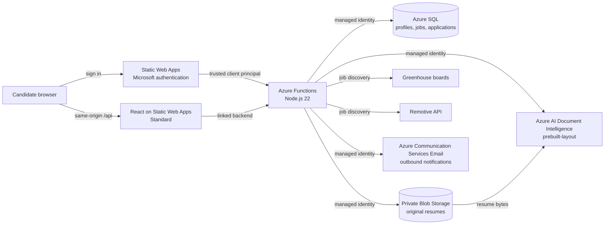
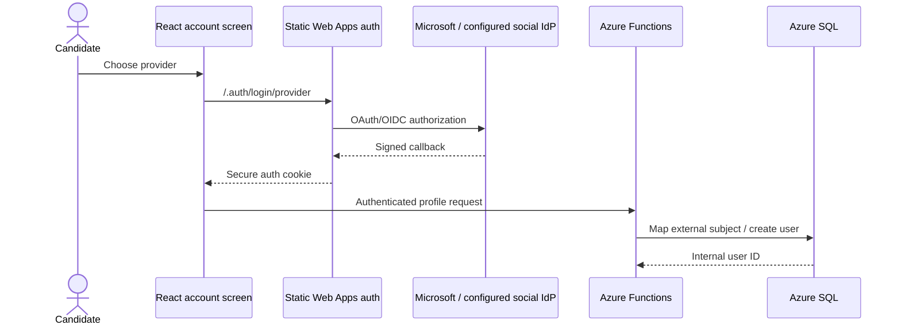
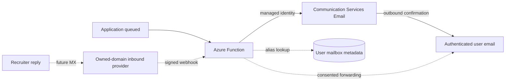
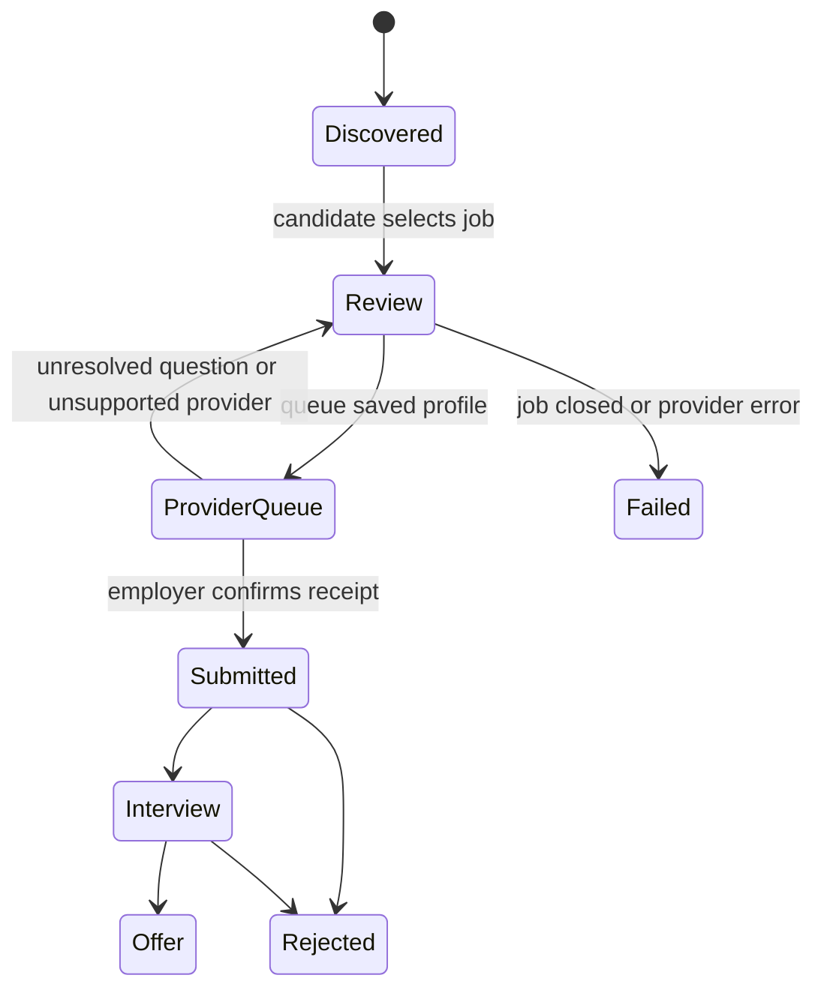
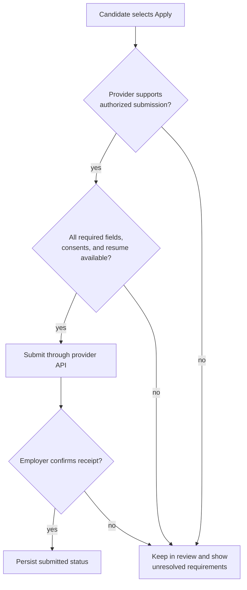

# ApplyPilot architecture

## System context

ApplyPilot is a review-first job application assistant. It discovers current jobs and prepares reusable candidate data, while the candidate reviews employer-specific questions and performs the final submission on the employer's site.

## End-to-end flows

### Authentication and user boundary

1. Static Web Apps authenticates the candidate with Microsoft Entra ID.
2. The linked backend receives the platform-generated `x-ms-client-principal` header.
3. Functions reject personal API calls without that trusted principal.
4. The external subject is mapped to an internal SQL user ID. Every profile, document, and application query is scoped to that ID.

Microsoft is currently enabled through the platform registration. Google and Facebook require separate developer registrations and secrets. They remain disabled in the UI until those external credentials and callbacks are configured; the app never simulates a successful provider.

### Email notification and future inbound alias flow

The inbound path uses Postmark's inbound stream and authenticated Azure Function webhook. Postmark parses messages addressed to a deterministic per-user alias, the Function maps that alias to an internal user, and SQL stores bounded plain-text content. The custom Dynu hostname is activated only after its MX record and Postmark inbound-domain forwarding are verified. Azure Communication Services remains the outbound notification service.

### Resume ingestion and profile enrichment

1. The signed-in browser sends a PDF or DOCX of at most 4 MB to `POST /api/resume` (the F0 analysis limit).
2. The Function validates MIME type and size and stores the original in the private `resumes` container under a hashed user prefix and random filename.
3. The Function uses its managed identity to call the GA `prebuilt-layout` Document Intelligence model.
4. Deterministic parsing derives candidate name, email, phone, LinkedIn, portfolio, and recognized technical skills from returned text.
5. Extraction output and status are recorded in SQL. Detected values fill only blank profile fields; existing candidate values are never overwritten.
6. The browser displays extraction status and asks the candidate to review the profile.

If analysis fails, the upload remains available and is recorded with `failed` extraction status. A temporary analysis failure therefore does not lose the candidate's file.

### Job discovery and application lifecycle

1. Azure Functions retrieves current jobs from configured Greenhouse boards and Remotive, normalizes them, and synchronizes searchable metadata to SQL.
2. The browser queries `/api/jobs`, filters results, and displays source provenance and direct employer URLs.
3. **Simple Apply** creates a SQL `review` queue record containing the job and saved profile answers without navigating away from ApplyPilot.
8. When a résumé upload or profile update enriches the candidate profile, queued applications are refreshed asynchronously with the latest saved answers.
9. The queue waits for an authorized provider-specific submission channel. Unsupported sources remain queued and are not represented as submitted.
10. An employer receipt advances the record to submitted; subsequent events advance through interview, offer, rejected, or failed.

### Submission integration boundary

The public Greenhouse feed exposes application questions, but submission requires a private API key issued by each hiring company. Remotive provides discovery and requires consumers to link back to its listing. ApplyPilot must not mark either source submitted without an employer receipt. A future user-controlled Playwright runner can prefill supported hosted forms, but it must pause for missing required questions, consent, CAPTCHA, and the final user-authorized submit action.

## Azure resources and security

| Component | Purpose | Security boundary |
| --- | --- | --- |
| Static Web Apps Standard | React hosting, Microsoft authentication, linked `/api` proxy | Personal API routes require the `authenticated` role |
| Azure Functions Consumption | API and orchestration | System-assigned managed identity; direct linked backend protected |
| Azure SQL Basic | Users, profiles, jobs, applications, document metadata | Entra app access; personal queries include the internal user ID |
| Storage account | Function runtime and original resumes | Public blob access disabled; private container; managed-identity RBAC |
| Document Intelligence F0/S0 | Resume OCR and layout extraction | Local keys disabled; managed-identity RBAC |
| Communication Services Email | Outbound application queue notifications | Azure-managed domain; managed-identity sender role; no inbound mailbox |
| Application Insights | Runtime diagnostics | 30-day retention configured by Bicep |
| Key Vault | Future application secrets | Function identity access; no resume or profile payloads stored here |

Traffic uses HTTPS/TLS and Azure-managed services encrypt stored data. No storage or Document Intelligence credential is exposed to the browser.

## Deployment boundaries

- `frontend/` builds and deploys independently to Static Web Apps.
- `backend/` packages and deploys independently to Azure Functions.
- `infra/` provisions resources, identities, RBAC, settings, and the linked backend with Bicep.
- `db/` contains forward-only migrations and the managed-identity bootstrap.

Infrastructure deployment precedes backend deployment when a service or setting is added. Database migrations run in filename order before code that depends on their columns is released.

## Reliability and observability

- Job providers are isolated so one provider failure does not invalidate other results.
- Resume upload and extraction have distinct outcomes; extraction failure does not discard the file.
- Health checks expose API and SQL connectivity without credentials or personal data.
- Application Insights receives Function errors and extraction warnings.
- Application snapshots preserve employer URLs and titles after upstream job removal.

## Current limitations and evolution

- Parsing uses the general layout model plus deterministic field detection. A custom neural model can improve work-history and education extraction after at least five representative, consented training resumes are available.
- Employer forms remain a separate trust domain. Future browser automation must preserve user review, consent, CAPTCHA, and site terms.
- Production hardening should add retention/deletion controls, malware scanning, private endpoints, queue-based asynchronous extraction, audit events, and user data export/deletion.

## Design references

- [Azure AI Document Intelligence overview](https://learn.microsoft.com/azure/ai-services/document-intelligence/overview)
- [Document Intelligence models and input limits](https://learn.microsoft.com/azure/ai-services/document-intelligence/model-overview)
- [Static Web Apps authentication and authorization](https://learn.microsoft.com/azure/static-web-apps/authentication-authorization)
- [Link an existing Azure Functions app to Static Web Apps](https://learn.microsoft.com/azure/static-web-apps/functions-bring-your-own)
